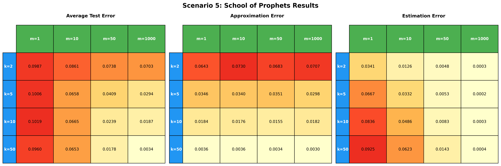
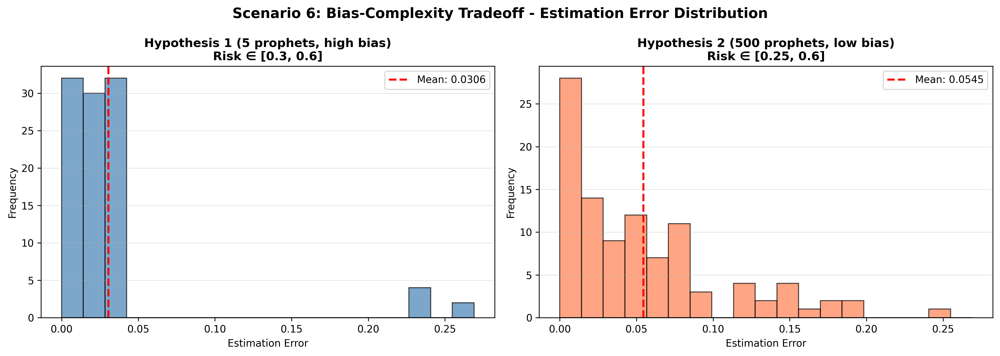
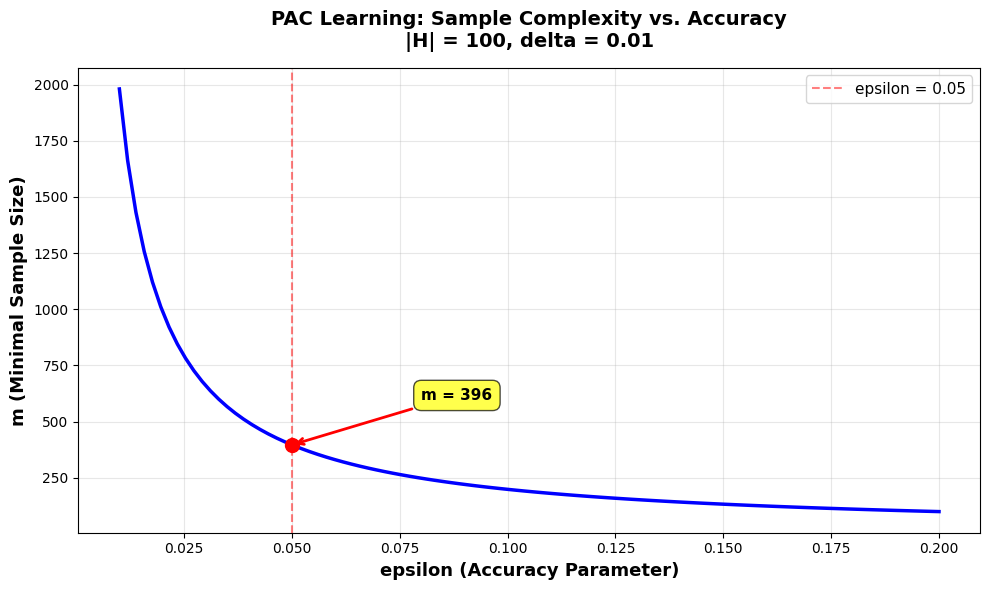
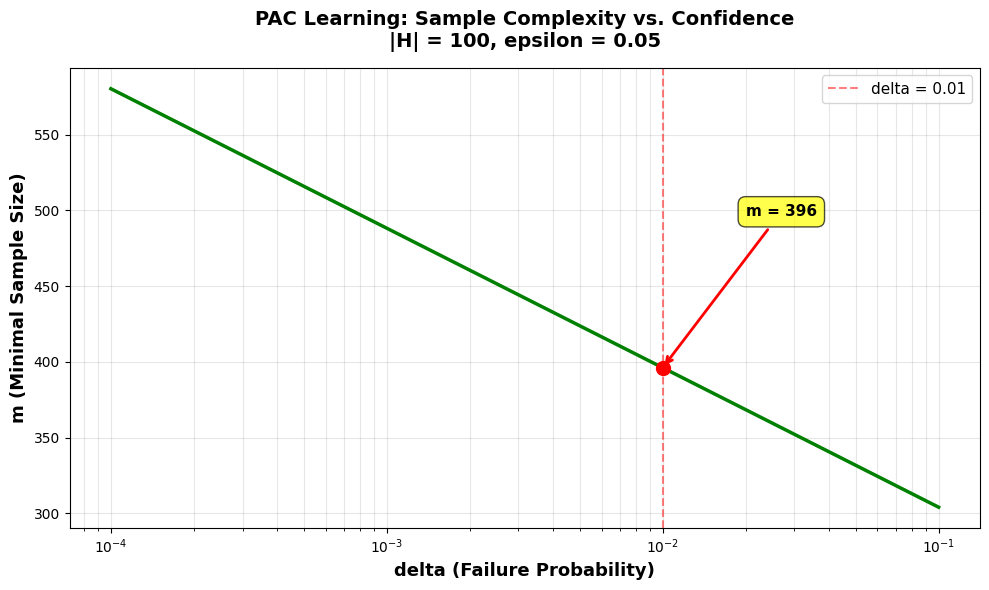

# part 2: scenarios:


  ## SCENARIO 1: Two Prophets, One Game
```
  Average test error:        0.3067
  Approximation error:       0.2000
  Estimation error:          0.0940
  Best prophet chosen:       53/100 times
```

## SCENARIO 2: Two Prophets, Ten Games
```
Average test error:        0.2213
Approximation error:       0.2000
Estimation error:          0.0240
Best prophet chosen:       88/100 times
```


## SCENARIO 3: Many Prophets, Ten Games
```
Average test error:        0.0930
Approximation error:       0.0064
Estimation error:          0.0852
Best prophet chosen:       3/100 times
Within 1% of best:         8/100 times
```
analysis: if the error rates were uniformly distributed between [0, 0.5] instead of [0, 1], the **approximation error would stay largely the same**, since we have haven't changes the lower bound on True risk. meanwhile, the **estimation error would be substantially smaller**, since even when we select a model whose true risk is greater than that of the best available model, the true risk of the chosen model will be closer to 0.

## SCENARIO 4: Many Prophets, Many Games

```
Average test error:        0.0064
Approximation error:       0.0064
Estimation error:          0.0008
Best prophet chosen:       50/100 times
Within 1% of best:         98/100 times
```

analysis:
if we evaluate the genralisation gap of a model based on the train set, we expect it to be **greater** than if we had masured generalisation gap based on the model's perfomrnace on the test. that is becuase the train set is a relatively small subset compared to the poplation and the model selection was biased in favor of a model performing well on the train set. no such bias affects the performance on the test set, and hence the test set provides a better approxiamtion of the gnerealisation gap. 

## SCENARIO 5: School of Prophets
```
Grid search completed
  k values (prophets):     [2, 5, 10, 50]
  m values (train games):  [1, 10, 50, 1000]
  Number of trials:        100
```

the grid search shows clear patterns:
as we increase **k** (class size) we increase two facotrs:
1. the chance of the available prophets including a prothet with a lower true risk, thus **decreasing approxiamtion error**` indeed k is almost entirely responsible for the approxiamtion error. 
2. increasing the chance of including a prophet that happened to perform well on the trian set, while having a greater true risk, thus **increasing estiamton error and test error**. 
meanwhile, increasing **m** (the training set size) makes it harder for a model to perform well on the train set despite having a higher true risk thus, it **decreases the estimation error and the test error**. 

indeed, we see that when we increased the number of games for ERM from scenario 1 to 2, we lowered the estimation and test error as expected.

furthermore, scenarios 3 and 4 exactly show how the approxiamtion error is affected primarily by k, while incresing m led to lower test and estiamtion errors.

## SCENARIO 6: Bias-Complexity Tradeoff
```
Hypothesis 1 (5 prophets, high bias):
  Average test error:      0.3570
  Approximation error:     0.3230
  Estimation error:        0.0306

Hypothesis 2 (500 prophets, low bias):
  Average test error:      0.3044
  Approximation error:     0.2500
  Estimation error:        0.0545
```

we see that while class 2 has models sampled from a 'better' range of true risk (lower bound 0.25 as opposed to 0.3), the estiamtion error is higher. this is as expected, since given a larger calss size there is a greater likelihood of choosing a sample with low error on the train set despite higher true risk. meanwhile, the fact that the models in calss 2 on average have lower true risk, leads to a lower test error. 

# part 3: pac learning analyis:

in this part we use the formula relating the number of samples to accuracy and cofidence:
`m = 2 * np.log(2 * h / delta) / epsilon`,
which can also be expressed as:
`m = (2 / epsilon) * (np.log(2)+np.log(h)-np.log(delta))`
we note that m is inversely proportional to epsilon and to the log of delta.
it is proportional to the log of h. 


## QUESTION 1: Compute minimal number of samples
```
Input Parameters:
  |H| (hypothesis class size) = 100
  epsilon (desired accuracy)  = 0.05
  delta (confidence level)    = 0.01
```

`Output:  m (rounded up)               = 397`


## QUESTION 2: Analyze change when |H| is doubled
```
Input Parameters:
  |H| (hypothesis class size) = 200 (doubled)
```
`Output:  m (rounded up)               = 424`

we see that if we double |H| we only need an additional 27 samples. if we refactor the equation we get `m = orignial_val + (2 / epsilon) * np.log(2)' which comes to 27


## QUESTION 3: Plot m as a function of epsilon in [0.01, 0.2]



we clearly see m increase in inverse proportion to epsilon. hence, to halve the error, we need to double the number of samples. 


## QUESTION 4: Plot m as a function of delta in [10^-4, 0.1] (log scale)




we clearly see that curve follows an exact logarimic scale. hence, to increase the confidence 10 fold, we need only increase the numerator by a factor of log(10), making this scale well. 